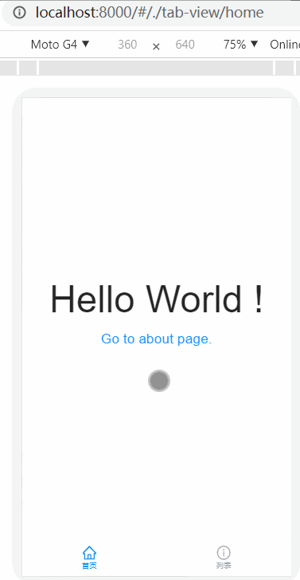
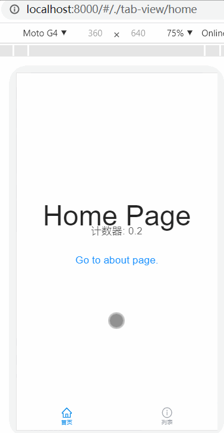

# umi-plugin-animation-routes

为移动端 h5 页面添加类似原生 APP 的 Activity 切换动画的 umi 插件， (for `umijs@3`)

[](https://npmjs.org/package/umi-plugin-animation-routes)
[](https://npmjs.org/package/umi-plugin-animation-routes)


## 功能介绍

### 路由动画

<p></p>

无需改变任何内容，在切换路由时，页面切换就会产生动画效果。你只需要继续使用`history.push`/`history.goBack`/`Link`进行页面跳转即可。

注意：请遵守路由跳转的语义，动画的切换是根据路由的`PUSH`/`POP`操作执行的，也就是如果你从`/home`跳转到`/about`，希望返回时，请执行`history.goBack()`而不是`history.push('/home')`。

### Persist(keep-alive)

如果你想要返回上一个页面时，还能够保持上一页的所有状态（比如你返回商品列表页面，自然是希望还在之前看的位置）

我为每个页面加了个计时器，并为`/about`加了`keep-alive`，效果请看下图：

<p></p>

上图中，路由跳转的顺序为`/home` → `/about(persist)` → `/test1` → `/about(persist)` → `/test1` → `/test2/` → `/test1` → `/about(persist)`

每次进入页面时，如果是第一次进入，则计时器从 0 开始计数。当后面两次回到`/about`页面时，可以发现计数器并不是从 0 开始，而是一直保持原有的计数（节点未被卸载）。而没有`keep-alive`处理的`/home`和`/test1`页面，则是从 0 开始计数（路由切换时，节点就被卸载了）

#### Persist 的使用方法

```jsx
import React from 'react';
/* 引入Persist组件 */
import { Persist } from 'umi';
import styles from './AboutPage.less';

const AboutPage = () => (
  <div className={styles.root}>
    {/* 在需要keep-alive的页面中使用即可 */}
    <Persist />
    <p className={styles.title}>This is About ...</p>
    ......
  </div>
);

export default AboutPage;
```

#### 如何使用 history.block

通常，我们可以使用`history.block`或`Prompt`，在当前页面跳转时进行拦截。如下面的示例

```jsx
import { Modal } from 'antd-mobile';
import { history, Prompt } from 'umi';

/* 通常的路由拦截的做法 */
export default () => {
  useEffect(() => {
    /* 注：默认情况下 history.block 或 Prompt 都不支持返回Promise以实现异步路由拦截 */
    return history.block( (method, args) => new Promise((resolve) => {
      console.log(method, args);
      Modal.alert('Warn', 'Do you want to leave???', [{ text: 'Cancel' }, { text: 'Ok', onPress: resolve }]);
    }));
  }, []);
  return (
    <div>
      <Prompt message={(method, args) => new Promise(resolve => {
        console.log(method, args);
        Modal.alert('Warn', 'Do you want to leave???', [
          { text: 'Cancel' },
          { text: 'Ok', onPress: resolve },
        ]);
      })}>
    </div>
  );
}
```

但是，由于`Persist`的特性，在页面被压入栈之后，`unmount`周期并不会触发。你将无法通过`componentWillUnmount`或`useEffect`捕获到页面离开的事件。

因此，上述示例中的两种方式创建的路由拦截，在页面离开（压入栈）后，仍然会生效。

为此，我在`Persist`组件上加入了`onShow`, `onHide`事件，用于监听`keep-alive`页面的显隐。下面是在使用了Persist的情况下，对路由进行拦截的实现方式。

```jsx
import { Modal } from 'antd-mobile';
import { history, Persist } from 'umi';

/* 在keep-alive页面中使用路由拦截的方法 */
export default () => {
  return (
    <div>
      {/* onShow 方法与 useEffect的习惯类似，允许返回一个方法，并在 onHide 时触发 */}
      <Persist
        onShow={() =>
          history.block(() => new Promise((resolve) => {
            Modal.alert('Warn', 'Do you want to leave???', [{ text: 'Cancel' }, { text: 'Ok', onPress: resolve }]);
          }))
        }
        onHide={() => console.log('hide')}
      />
    </div>
  );
}
```

## Why

PC 端页面中，动画效果本身就不是特别丰富，特别是对于页面切换的动画，几乎没有这样的需求。

但在移动端就不一样，所有的操作都应该有视觉上的反馈，特别是对于页面的切换。在 Native App，每个活动页面的切换，默认都会添加过渡动画。而我们想要使用 html 去开发 Hybrid App，那么实现一些基本的动画效果是必不可少的。这个插件就是为使用`umijs@3`的小伙伴们实现路由切换动画而生。

## Notice

- 插件覆盖了`umijs`默认的`clientRender`逻辑，可能会与其它使用`clientRender`的插件产生冲突。
- 插件对`umijs`所使用的`history`进行了拦截处理，可能会对其它拦截`history`的操作产生影响。
  - 替换了原有`history.block`的逻辑，增加了对`callback`的`async function`支持，兼容原有使用方法。
  - 如果使用了回调函数作为`history.block`的参数，回调函数中将无法获取`location`信息。作为替代，触发路由跳转的方法和参数将会作为回调函数的参数。
  - 对`replace`/`push`/`go`/`goBack`/`goForward`方法进行了拦截，支持新的`history.block`逻辑。

## Install

```bash
# npm or yarn
$ npm install umi-plugin-animation-routes -D
```

## Usage

`umijs@3`会扫描符合命名规则的插件并自动注册

## Options

Configure in `.umirc.js`,

```js
export default {
  /* latter */
};
```

## LICENSE

MIT
